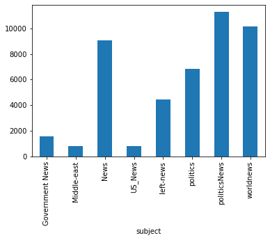
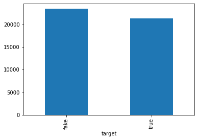
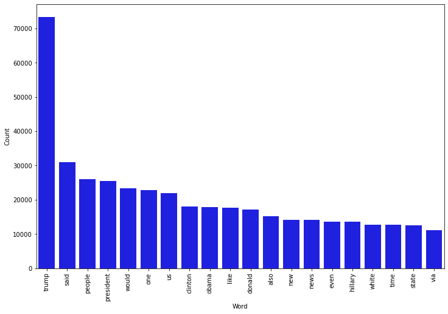
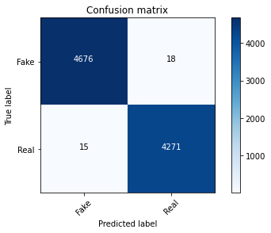

```python
import pandas as pd
import numpy as np
import matplotlib.pyplot as plt
import seaborn as sns 
from sklearn.feature_extraction.text import CountVectorizer
from sklearn.feature_extraction.text import TfidfTransformer
from sklearn import feature_extraction, linear_model, model_selection, preprocessing
from sklearn.metrics import accuracy_score
from sklearn.model_selection import train_test_split
from sklearn.pipeline import Pipeline
```


```python
fake = pd.read_csv(r"C:\Users\hruti\Desktop\Fake.csv")
true = pd.read_csv(r"C:\Users\hruti\Desktop\True.csv")

```


```python
fake.shape
```


    (23481, 4)


```python
true.shape
```


    (21417, 4)


```python
fake['target'] = 'fake'
true['target'] = 'true'
```


```python
data = pd.concat([fake, true]).reset_index(drop = True)
data.shape
```


    (44898, 5)


```python
from sklearn.utils import shuffle
data = shuffle(data)
data = data.reset_index(drop=True)
```


```python
data.head()
```


<div>
<style scoped>
    .dataframe tbody tr th:only-of-type {
        vertical-align: middle;
    }

    .dataframe tbody tr th {
        vertical-align: top;
    }

    .dataframe thead th {
        text-align: right;
    }
</style>
<table border="1" class="dataframe">
  <thead>
    <tr style="text-align: right;">
      <th></th>
      <th>title</th>
      <th>text</th>
      <th>subject</th>
      <th>date</th>
      <th>target</th>
    </tr>
  </thead>
  <tbody>
    <tr>
      <th>0</th>
      <td>OBAMA LIES ABOUT Number Of Troops On Ground In...</td>
      <td>It was more important for Obama to keep a pled...</td>
      <td>left-news</td>
      <td>Mar 22, 2016</td>
      <td>fake</td>
    </tr>
    <tr>
      <th>1</th>
      <td>Abbas: Palestinians will go to Security Counci...</td>
      <td>CAIRO (Reuters) - Palestinian President Mahmou...</td>
      <td>worldnews</td>
      <td>December 13, 2017</td>
      <td>true</td>
    </tr>
    <tr>
      <th>2</th>
      <td>Trump's outrage finds ready audience in strugg...</td>
      <td>LUCEDALE, Miss (Reuters) - Mississippi’s vast ...</td>
      <td>politicsNews</td>
      <td>February 24, 2016</td>
      <td>true</td>
    </tr>
    <tr>
      <th>3</th>
      <td>HILLARY’S LAP DOG VA Senator Tim Kaine Calls F...</td>
      <td>Can anyone imagine a sitting Republican Senato...</td>
      <td>politics</td>
      <td>Feb 2, 2017</td>
      <td>fake</td>
    </tr>
    <tr>
      <th>4</th>
      <td>STUNNING DISREGARD FOR LAW: 11 CA Counties Hav...</td>
      <td>But..b but it isn t fair to ask for voter ID s...</td>
      <td>left-news</td>
      <td>Aug 7, 2017</td>
      <td>fake</td>
    </tr>
  </tbody>
</table>
</div>


```python
data.drop(["date"],axis=1,inplace=True)
data.head()
```


<div>
<style scoped>
    .dataframe tbody tr th:only-of-type {
        vertical-align: middle;
    }

    .dataframe tbody tr th {
        vertical-align: top;
    }

    .dataframe thead th {
        text-align: right;
    }
</style>
<table border="1" class="dataframe">
  <thead>
    <tr style="text-align: right;">
      <th></th>
      <th>title</th>
      <th>text</th>
      <th>subject</th>
      <th>target</th>
    </tr>
  </thead>
  <tbody>
    <tr>
      <th>0</th>
      <td>OBAMA LIES ABOUT Number Of Troops On Ground In...</td>
      <td>It was more important for Obama to keep a pled...</td>
      <td>left-news</td>
      <td>fake</td>
    </tr>
    <tr>
      <th>1</th>
      <td>Abbas: Palestinians will go to Security Counci...</td>
      <td>CAIRO (Reuters) - Palestinian President Mahmou...</td>
      <td>worldnews</td>
      <td>true</td>
    </tr>
    <tr>
      <th>2</th>
      <td>Trump's outrage finds ready audience in strugg...</td>
      <td>LUCEDALE, Miss (Reuters) - Mississippi’s vast ...</td>
      <td>politicsNews</td>
      <td>true</td>
    </tr>
    <tr>
      <th>3</th>
      <td>HILLARY’S LAP DOG VA Senator Tim Kaine Calls F...</td>
      <td>Can anyone imagine a sitting Republican Senato...</td>
      <td>politics</td>
      <td>fake</td>
    </tr>
    <tr>
      <th>4</th>
      <td>STUNNING DISREGARD FOR LAW: 11 CA Counties Hav...</td>
      <td>But..b but it isn t fair to ask for voter ID s...</td>
      <td>left-news</td>
      <td>fake</td>
    </tr>
  </tbody>
</table>
</div>


```python
data.drop(["title"],axis=1,inplace=True)
data.head()
```


<div>
<style scoped>
    .dataframe tbody tr th:only-of-type {
        vertical-align: middle;
    }

    .dataframe tbody tr th {
        vertical-align: top;
    }

    .dataframe thead th {
        text-align: right;
    }
</style>
<table border="1" class="dataframe">
  <thead>
    <tr style="text-align: right;">
      <th></th>
      <th>text</th>
      <th>subject</th>
      <th>target</th>
    </tr>
  </thead>
  <tbody>
    <tr>
      <th>0</th>
      <td>It was more important for Obama to keep a pled...</td>
      <td>left-news</td>
      <td>fake</td>
    </tr>
    <tr>
      <th>1</th>
      <td>CAIRO (Reuters) - Palestinian President Mahmou...</td>
      <td>worldnews</td>
      <td>true</td>
    </tr>
    <tr>
      <th>2</th>
      <td>LUCEDALE, Miss (Reuters) - Mississippi’s vast ...</td>
      <td>politicsNews</td>
      <td>true</td>
    </tr>
    <tr>
      <th>3</th>
      <td>Can anyone imagine a sitting Republican Senato...</td>
      <td>politics</td>
      <td>fake</td>
    </tr>
    <tr>
      <th>4</th>
      <td>But..b but it isn t fair to ask for voter ID s...</td>
      <td>left-news</td>
      <td>fake</td>
    </tr>
  </tbody>
</table>
</div>


```python
data['text'] = data['text'].apply(lambda x: x.lower())
data.head()
```


<div>
<style scoped>
    .dataframe tbody tr th:only-of-type {
        vertical-align: middle;
    }

    .dataframe tbody tr th {
        vertical-align: top;
    }

    .dataframe thead th {
        text-align: right;
    }
</style>
<table border="1" class="dataframe">
  <thead>
    <tr style="text-align: right;">
      <th></th>
      <th>text</th>
      <th>subject</th>
      <th>target</th>
    </tr>
  </thead>
  <tbody>
    <tr>
      <th>0</th>
      <td>it was more important for obama to keep a pled...</td>
      <td>left-news</td>
      <td>fake</td>
    </tr>
    <tr>
      <th>1</th>
      <td>cairo (reuters) - palestinian president mahmou...</td>
      <td>worldnews</td>
      <td>true</td>
    </tr>
    <tr>
      <th>2</th>
      <td>lucedale, miss (reuters) - mississippi’s vast ...</td>
      <td>politicsNews</td>
      <td>true</td>
    </tr>
    <tr>
      <th>3</th>
      <td>can anyone imagine a sitting republican senato...</td>
      <td>politics</td>
      <td>fake</td>
    </tr>
    <tr>
      <th>4</th>
      <td>but..b but it isn t fair to ask for voter id s...</td>
      <td>left-news</td>
      <td>fake</td>
    </tr>
  </tbody>
</table>
</div>


```python
import string

def punctuation_removal(text):
    all_list = [char for char in text if char not in string.punctuation]
    clean_str = ''.join(all_list)
    return clean_str

data['text'] = data['text'].apply(punctuation_removal)
```


```python
data.head()

```


<div>
<style scoped>
    .dataframe tbody tr th:only-of-type {
        vertical-align: middle;
    }

    .dataframe tbody tr th {
        vertical-align: top;
    }

    .dataframe thead th {
        text-align: right;
    }
</style>
<table border="1" class="dataframe">
  <thead>
    <tr style="text-align: right;">
      <th></th>
      <th>text</th>
      <th>subject</th>
      <th>target</th>
    </tr>
  </thead>
  <tbody>
    <tr>
      <th>0</th>
      <td>it was more important for obama to keep a pled...</td>
      <td>left-news</td>
      <td>fake</td>
    </tr>
    <tr>
      <th>1</th>
      <td>cairo reuters  palestinian president mahmoud a...</td>
      <td>worldnews</td>
      <td>true</td>
    </tr>
    <tr>
      <th>2</th>
      <td>lucedale miss reuters  mississippi’s vast flat...</td>
      <td>politicsNews</td>
      <td>true</td>
    </tr>
    <tr>
      <th>3</th>
      <td>can anyone imagine a sitting republican senato...</td>
      <td>politics</td>
      <td>fake</td>
    </tr>
    <tr>
      <th>4</th>
      <td>butb but it isn t fair to ask for voter id say...</td>
      <td>left-news</td>
      <td>fake</td>
    </tr>
  </tbody>
</table>
</div>


```python
import nltk
nltk.download('stopwords')
from nltk.corpus import stopwords
stop = stopwords.words('english')

data['text'] = data['text'].apply(lambda x: ' '.join([word for word in x.split() if word not in (stop)]))
```

    [nltk_data] Downloading package stopwords to
    [nltk_data]     C:\Users\hruti\AppData\Roaming\nltk_data...
    [nltk_data]   Unzipping corpora\stopwords.zip.
    


```python
data.head()
```


<div>
<style scoped>
    .dataframe tbody tr th:only-of-type {
        vertical-align: middle;
    }

    .dataframe tbody tr th {
        vertical-align: top;
    }

    .dataframe thead th {
        text-align: right;
    }
</style>
<table border="1" class="dataframe">
  <thead>
    <tr style="text-align: right;">
      <th></th>
      <th>text</th>
      <th>subject</th>
      <th>target</th>
    </tr>
  </thead>
  <tbody>
    <tr>
      <th>0</th>
      <td>important obama keep pledge leftist donors sec...</td>
      <td>left-news</td>
      <td>fake</td>
    </tr>
    <tr>
      <th>1</th>
      <td>cairo reuters palestinian president mahmoud ab...</td>
      <td>worldnews</td>
      <td>true</td>
    </tr>
    <tr>
      <th>2</th>
      <td>lucedale miss reuters mississippi’s vast flatl...</td>
      <td>politicsNews</td>
      <td>true</td>
    </tr>
    <tr>
      <th>3</th>
      <td>anyone imagine sitting republican senator call...</td>
      <td>politics</td>
      <td>fake</td>
    </tr>
    <tr>
      <th>4</th>
      <td>butb fair ask voter id says party dominates st...</td>
      <td>left-news</td>
      <td>fake</td>
    </tr>
  </tbody>
</table>
</div>


```python
print(data.groupby(['subject'])['text'].count())
data.groupby(['subject'])['text'].count().plot(kind="bar")
plt.show()

```

    subject
    Government News     1570
    Middle-east          778
    News                9050
    US_News              783
    left-news           4459
    politics            6841
    politicsNews       11272
    worldnews          10145
    Name: text, dtype: int64
    


    

    


```python
print(data.groupby(['target'])['text'].count())
data.groupby(['target'])['text'].count().plot(kind="bar")
plt.show()
```

    target
    fake    23481
    true    21417
    Name: text, dtype: int64
    


    

    


```python
from nltk import tokenize

token_space = tokenize.WhitespaceTokenizer()

def counter(text, column_text, quantity):
    all_words = ' '.join([text for text in text[column_text]])
    token_phrase = token_space.tokenize(all_words)
    frequency = nltk.FreqDist(token_phrase)
    df_frequency = pd.DataFrame({"Word": list(frequency.keys()),
                                   "Frequency": list(frequency.values())})
    df_frequency = df_frequency.nlargest(columns = "Frequency", n = quantity)
    plt.figure(figsize=(12,8))
    ax = sns.barplot(data = df_frequency, x = "Word", y = "Frequency", color = 'blue')
    ax.set(ylabel = "Count")
    plt.xticks(rotation='vertical')
    plt.show()
```


```python
counter(data[data["target"] == "fake"], "text", 20)
```


    

    


```python
from sklearn import metrics
import itertools

def plot_confusion_matrix(cm, classes,
                          normalize=False,
                          title='Confusion matrix',
                          cmap=plt.cm.Blues):
    
    plt.imshow(cm, interpolation='nearest', cmap=cmap)
    plt.title(title)
    plt.colorbar()
    tick_marks = np.arange(len(classes))
    plt.xticks(tick_marks, classes, rotation=45)
    plt.yticks(tick_marks, classes)

    if normalize:
        cm = cm.astype('float') / cm.sum(axis=1)[:, np.newaxis]
        print("Normalized confusion matrix")
    else:
        print('Confusion matrix, without normalization')

    thresh = cm.max() / 2.
    for i, j in itertools.product(range(cm.shape[0]), range(cm.shape[1])):
        plt.text(j, i, cm[i, j],
                 horizontalalignment="center",
                 color="white" if cm[i, j] > thresh else "black")

    plt.tight_layout()
    plt.ylabel('True label')
    plt.xlabel('Predicted label')
```


```python
X_train,X_test,y_train,y_test = train_test_split(data['text'], data.target, test_size=0.2, random_state=42)
```


```python
##Logistic Regression
```


```python
from sklearn.linear_model import LogisticRegression

pipe = Pipeline([('vect', CountVectorizer()),
                 ('tfidf', TfidfTransformer()),
                 ('model', LogisticRegression())])

# Fitting the model
model = pipe.fit(X_train, y_train)

# Accuracy
prediction = model.predict(X_test)
print("accuracy: {}%".format(round(accuracy_score(y_test, prediction)*100,2)))
```

    accuracy: 99.1%
    


```python
cm = metrics.confusion_matrix(y_test, prediction)
plot_confusion_matrix(cm, classes=['Fake', 'Real'])
```

    Confusion matrix, without normalization
    


    

    


```python
##Decision Tree Classification
```


```python
from sklearn.tree import DecisionTreeClassifier

# Vectorizing and applying TF-IDF
pipe = Pipeline([('vect', CountVectorizer()),
                 ('tfidf', TfidfTransformer()),
                 ('model', DecisionTreeClassifier(criterion= 'entropy',
                                           max_depth = 20, 
                                           splitter='best', 
                                           random_state=42))])
# Fitting the model
model = pipe.fit(X_train, y_train)

# Accuracy
prediction = model.predict(X_test)
print("accuracy: {}%".format(round(accuracy_score(y_test, prediction)*100,2)))
```

    accuracy: 99.63%
    


```python
cm = metrics.confusion_matrix(y_test, prediction)
plot_confusion_matrix(cm, classes=['Fake', 'Real'])
```

    Confusion matrix, without normalization
    


    

    


```python

```


```python

```
